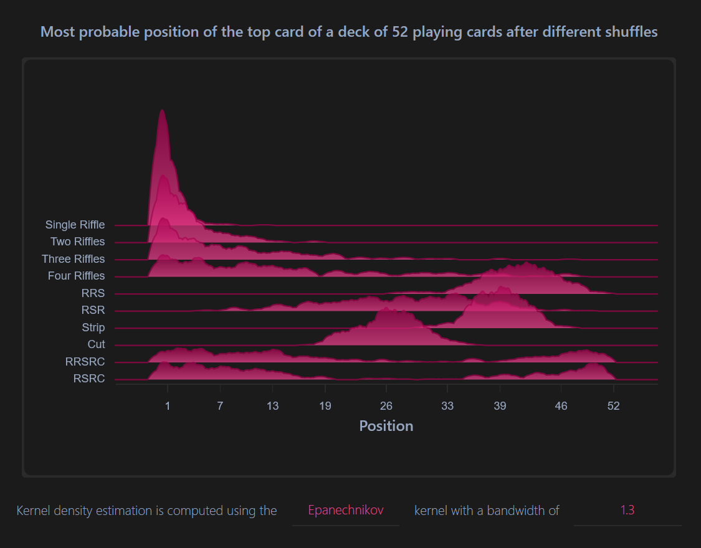

# Shuffle Probabilities

Consider a deck of 52 playing cards. After giving the deck a shuffle, where would you most likely find the original top card? 

I created this small web-application based on [Next.js](https://nextjs.org/) and [visx](https://airbnb.io/visx) to give you the answer for several different types of shuffles.



## Development

To run the simulation models yourself, create a python environment and install the only dependency numpy:

```
python -m venv .venv 
pip install numpy
```

Calling `model.py` will then run the simulations and store the results in the `data.json` where it is picked up by the Next.js application.
